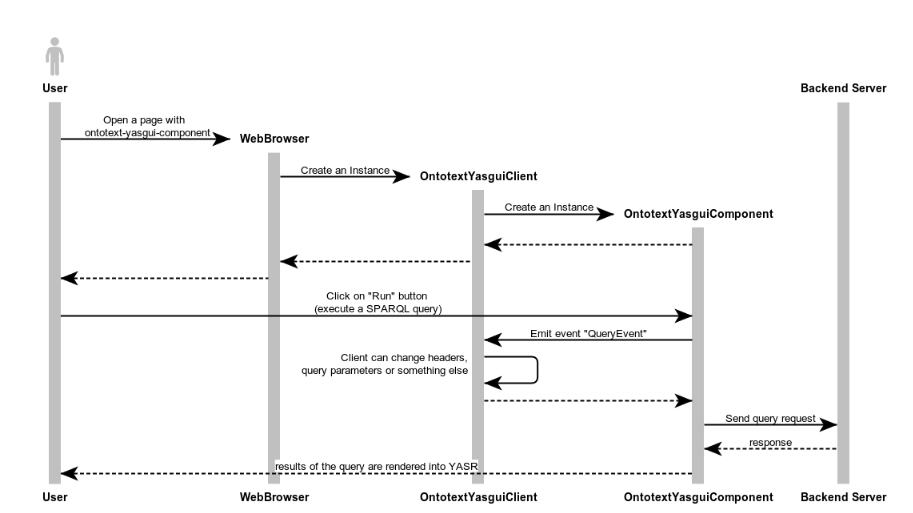
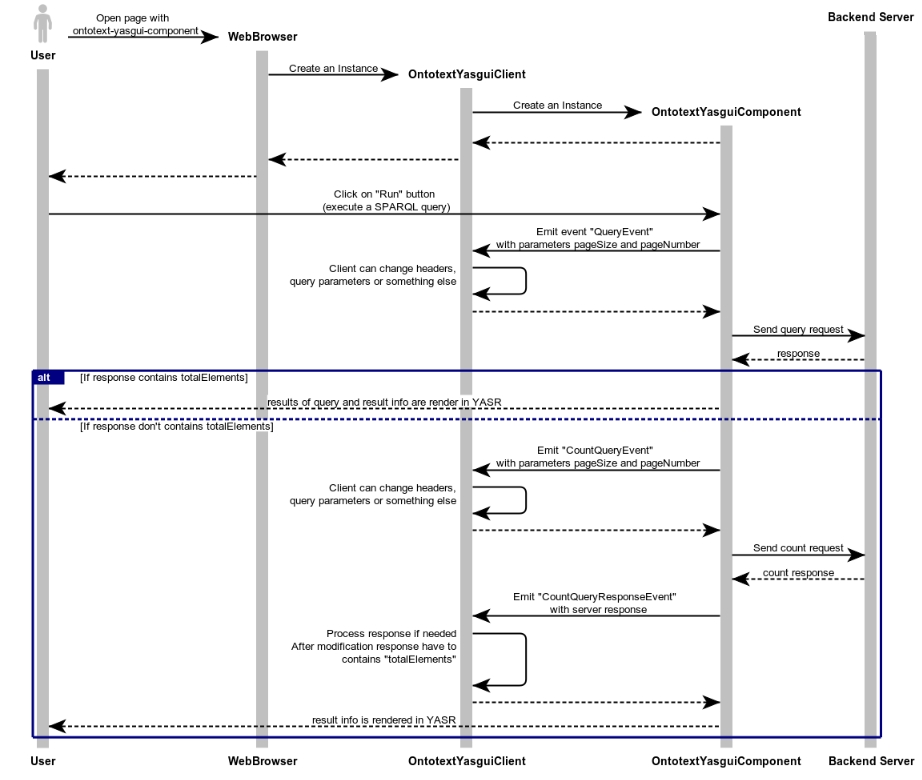

# Ontotext Yasgui Web Component

## Approach for the component implementation and YASGUI customization

- For every change, patch or configuration in the library there must be a unit or UI test which 
  covers the case except for changes in the styling.
- Applying a fix means: for every needed change, find a way to apply it in an unobtrusive way first.
  1. Try to configure the YASGUI/YASQE/YASR using their configuration;
  2. Try to change the needed behaviour by YASGUI/YASQE/YASR using their public api;
  3. Тry to do some runtime monkey-patching:
  4. In the end, if the change is impossible to be introduced in an unobtrusive way, then apply the
     change in the respective file in the library, then create a patch file following proper naming
     convention which includes the date/timestamp and include it in the source code with the WB so
     that it can be easier to be applied to newer versions of the library.

## Implementation and testing of new features/customizations

For each new feature or extension in the component and/or YASGUI, a new page should be implemented 
in `ontotext-yasgui-web-component/src/pages` where the component should be included with the 
respective configurations and event handlers. The pages are used for manual testing of the features
and by the automated component tests.

In cypress component tests, for any particular feature the respective page is visited first, then
actions and verifications are applied.

> Testing the component integration in the GraphDB workbench locally without publishing in NPM:
> * Build the component `npm run build`
> * Create a simlink to the component's source code in the root of the GraphDB workbench project
> by executing `npx link /path/to/ontotext-yasgui/ontotext-yasgui-web-component`. You must
> have `npx` installed. Otherwise consider some of the other options [here](https://hirok.io/posts/avoid-npm-link).
> * Start GgraphDB instance. Check GDB documentation how to do this.
> * Start the GDB workbench in dev mode `npm run start` and you can test the component integration.
> While the GDB workbench is running in dev mode you can rebuild the yasgui web component and thw workbench
> will automatically reload itself with the latest changes.
> 
> After this the component's source code should be linked like it's been installed via NPM.
> 
> After any change in the component's source code it must be built and again! 

## Stencil

"ontotex-yasgui-web-component" component is build with Stencil compiler.

Check out stenciljs docs [here](https://stenciljs.com/docs/my-first-component).

When component is built it can be used in any supported by stenciljs environment or in native 
javascript web application, but there might be differences, e.g. if it's used in angulajs version 
before 1.7.3, then additional custom directive must be installed on the client application.

# Development tips

## Properties

| Stencil                             | angularjs version before 1.7.3 template                                      | html template                                         | Description                   |
|-------------------------------------|------------------------------------------------------------------------------|-------------------------------------------------------|-------------------------------|
| ```@Prop() configProperty: {};``` | ```<ontotex-yasgui ng-custom-element ngce-prop-config_property="config"/>``` | ```<ontotex-yasgui [configProperty]="config"/>```     | config is controller property |
| ```@Prop() configProperty: string;``` | ```<ontotex-yasgui config-property="stringValue"/>```                        | ```<ontotex-yasgui config-property="stringValue"/>``` |                               |

## Output events
| Stencil                                    | Angularjs version before 1.7.3 template                                                     | Html template                                      | Descriptions  |
|--------------------------------------------|---------------------------------------------------------------------------------------------|----------------------------------------------------|---------------|
| ```@Event() yasguiOutput: EventEmitter;``` | ```<ontotex-yasgui ng-custom-element ngce-on-yasgui_output="controlerFunction($event)"/>``` | ```(yasguiOutput)="controlerFunction($event)"/>``` |               |

## Watch decorator
@Watch() is a decorator that is applied to a method of a Stencil component. The decorator accepts a single argument, the name of a class member that is decorated with @Prop() or @State().
<br>**<span style="color:red">The @Watch() decorator does not fire when a component initially loads.</style>**
<br>if we want method to be called we have to use the "componentDidLoad" of component lifecycle methods.

```
  componentDidLoad() {
    this.configurationChanged(this.config);
  }

  @Watch('config')
  configurationChanged(newConfig: YasguiConfiguration) {
    this.init(newConfig);
  }
```

## Public instance methods

The ontotext yasgui web component exposes a public API which can be accessed through the component
instance in the following way:

```
const ontoElement = document.querySelector('ontotext-yasgui');
ontoElement.openTab(...);
```

The public API documentation can be found [here](../src/components/ontotext-yasgui-web-component/readme.md)


# Components
## OntotextTooltipWebComponent
 ### Usage
```
<yasgui-tooltip yasgui-data-tooltip={this.orientationButtonTooltip} placement="left" show-on-click={true}>
  <div class="btn-orientation icon-columns red" onClick={() => this.changeOrientation()}></div>
</yasgui-tooltip>
```
yasgui-tooltip tag have to wrap the element to which tooltip have to be appeared.
### Configuration
- <b>yasgui-data-tooltip</b>: value of this property will be the content of the tooltip;
- <b>placement</b>: where tooltip to be appeared. default is top:
- <b>show-on-click</b>: if tooltip have to be shown when wrapped element is clicked. Default behaviour is when mouse is over the element.

# Services

Services are just plain javascript classes. 

There is a service factory which is responsible for service creation. 
The factory must be used everywhere a service is needed. 

Example of a Service

```javascript
export class YasqeService {
  ...
}
```

And injecting it like this:

```javascript
export class SomeComponentOrService {
  private yasqeService: YasqeService;

  constructor(serviceFactory: ServiceFactory) {
    this.yasqeService = serviceFactory.get(YasqeService);
  } 
}
```
**<span style="color:red">IMPORTANT:</style>** If a service depends on another services then it have to introduce constructor
with ServiceFactory as parameter. It will be passed automatically by factory when service is created.

# Custom YASQE actions

YASQE editor exposes an extension point

```
yasqe.pluginButtons?: (() => HTMLElement[] | HTMLElement) | undefined;
```

which allows custom action buttons to be plugged in the editor. This component employs the extension point and plugs in a couple of buttons
implementing actions like: save query, load saved queries, expand query results, etc.

Custom action buttons can be plugged in the yasqe editor by providing a `YasqeActionButtonDefinition` to the `yasqeActionButtons` config in 
the component client.

```
{
  yasqeActionButtons: [
    {
      name: 'createSavedQuery',
      visible: true
    }
  ]
}
```

If the action button has implementation in the component, then it will be added in the editor toolbar during the initialization.
If any action button has to be hidden, then pass the `visible: false` property in the button definition.

The action buttons can have the following example implementation:

```javascript
const createSavedQueryButton = document.createElement("button");
createSavedQueryButton.className = "yasqe_createSavedQueryButton custom-button ri-save-line";
createSavedQueryButton.title = this.translationService.translate('yasqe.actions.save_query.button.tooltip');
createSavedQueryButton.setAttribute("aria-label", this.translationService.translate('yasqe.actions.save_query.button.tooltip'));
createSavedQueryButton.addEventListener("click",
  () => this.eventService.emit(InternalCreateSavedQueryEvent.TYPE, new InternalCreateSavedQueryEvent()));
```

Currently, the action buttons which are plugged in:
```
"createSavedQuery" - opens the save query dialog  
```
```
"showSavedQueries" - triggers loading of saved queries and shows them in a popup  
```
```
"shareQuery" - obtains a shareable link for the current query and opens a copy link dialog  
```
```
"includeInferredStatements" - include infered data in sparql results. When is true additional action button "expandResultsOverSameAs" will be added.
"expandResultsOverSameAs" - expand results over owl:sameAs
```

## Recommendations for implementing custom action buttons

* Buttons are implemented in TODO:
* Every button must have as a minimum following css class names:
  * `yasqe_[actionName]Button` - unique class name to identify the button
  * `custom-button` - a marker class used for generic buttons styling in the editor
  * `icon-plus` - an icon as font applied with a css class (see: ontotext-yasgui-web-component/src/css/_icons.scss)
* Every button must have a title and aria-label. The title must be translated in all supported languages.
* In the button's click handler can be emitted a named internal event through the `EventService` if necessary. This event can be 
  handled in the web component and eventually propagated further to the outside world.
  
# Internal events

Events emitted by some child component or service are considered internal if they are not propagated to outside world.

> Any internal event must be prefixed with `internal`, e.g. `internalSaveQueryEvent`.

If an event should be fired by a service class, then it's recommended the `EventService` to be used due
to a bug in the stencil core which prevents using the builtin event emitter.

```javascript
export class ServiceName {
  private eventService: EventService;
  
  serviceMethod() {
    this.eventService.emit(InternalCreateSavedQueryEvent.TYPE, new InternalCreateSavedQueryEvent())
  }
}
```

# Integration events - Actions

In result of certain operations in the yasgui component are raised events that are responsibility
of the client to handle properly and to respond in the expected way.

There are two kind of event communication with client. One event emitter per an event and an emitter for many events.
## One emitter per event

* **queryResponse: EventEmitter\<QueryResponseEvent>**
  * Description: Event emitted when after query response is returned.
  * Response: None
* **createSavedQuery: EventEmitter\<SaveQueryData>**:
  * Description: Event emitted when saved query payload is collected and the query should be saved by the component client. 
  * Response: The client must set in the config following data.
  ```
    {
      savedQuery: {
        saveSuccess: boolean; // if save was successful or not
        errorMessage: string[]; // if any error happen then messages must be passed back
      }
    };
  ```
* **loadSavedQueries: EventEmitter\<boolean>**:
  * Description: Event emitted when saved queries is expected to be loaded by the component client and provided back in order to be displayed.
  * Response: The client must set in the config following data:
  ```
  {
    savedQueries: {
      data: {
        queryName: string;
        query: string;
        owner: string;
        isPublic: boolean;
      }[]
    }
  }
  ```
## One emitter for many events

* **output: EventEmitter<OutputEvent>**: used for communication with the client. All events emitted by output emitter have tobe subclasses
of OutputEvent. Every output event have two properties: **Type** a unique string and **payload** data of the event. 

### Output events

* **QueryEvent**: emitted before a query to be executed. The payload of event is the request, which will be sent to the backend server. Client can modify what is necessary, endpoint, query parameters, headers e.t.
* **CountQueryEvent**: emitted before count query (if pagination is turned on see query flow below) to be executed. The payload of event is the request, which will be sent to the backend server. Client can modify what is necessary, endpoint, query parameters, headers e.t.
* **CountQueryResponseEvent**: emitted after a count query (if pagination is turned on see query flow below) was executed. The payload of event is the server response. Responsibility of client is to process response (if needed) and modify it, as result response have to contain filled property **totalElements**.
* **NotificationMessageEvent**: emitted when a message have to be shown. Display of the message is the customer's responsibility. Payload properties are:
  * code - unique code of a message;
  * messageType - message type. Can be: "success", "warning" or "error";
  * message - translated message.

# Query flow
Ontotext yasgui component query execution can be configured in two ways.
## Query without pagination
In this mode all results are displayed without pagination. To turn on this mode configuration **paginationOn** have to be set to false.
In this mode a query will be sent to the backend server.
Sequence of query execution:
1. A user click on button "Run";
2. Ontotext-yasgui-component emits QueryEvent through the output emitter;
3. The client can modify the request passed as event payload;
4. Ontotext-yasgui-component sends request to the backend server;
5. Ontotext-yasgui-component displays results.
   
## Query with pagination
In this mode results are displayed with pagination. To turn on this mode configuration **paginationOn** have to be set to true.
1. A user click on button "Run";
2. Ontotext-yasgui-component emits QueryEvent through the output emitter. The request of event payload will contain query parameters "pageSize" and "pageNumber". **<span style="color:red">pageSize value is configured pageSize plus one</style>**. If result of query not contains "totalElements", then second query "countQuery" is going to be sent. The second query is asynchronous, can be slow or be aborted by server. This is why page size is plus one, if count of the results is equal to page size plus one, this mean that there is more results.
3. The client can modify the request passed as event payload;
4. Ontotext-yasgui-component sends request to the backend server;
5. If the response of the server has the property "totalElements";
  5.1 Ontotext-yasgui-component displays results and results info.
6. Else <br>
  6.1 Ontotext-yasgui-component emits CountQueryEvent through the output emitter;<br>
  6.2 The client can modify the request passed as event payload;<br>
  6.3 Ontotext-yasgui-component sends request to the backend server;
  6.4 The client can modify the server response passed as event payload;<br>. The response have to contain filed totalElements property.
  6.5 Ontotext-yasgui-component updates results info.



# YASQE SPARQL grammar

Sparql grammar definition file can be found in `Yasgui/packages/yasqe/grammar/sparql11-grammar.pl`. We did a couple of
changes in the grammar related with the embedded triples support. 

## Grammar update

When grammar definition is updated, the `_tokenizer-table.js` file must be rebuilt. This can be done with SWI Prolog as
stated in the README file. It happened that prolog installation on unix/linux is quite cumbersome. Also, there is a docker
image published in docker hub although it appeared that the prolog grammar build script throws some errors during 
execution with the latest prolog versions 8.4 and above and unfortunately there isn't any tagged image with a lower 
version. So, the easiest way to rebuild the tokenizer table is to download a windows installer and use it for the task.
Follow the steps below:

* Download the installer from https://eu.swi-prolog.org/download/stable/bin/swipl-8.2.4-1.x64.exe.envelope
* Install it on 64bit windows 7 or greater. During the installation, choose to register the executable in PATH.
* Open terminal in the `grammar` folder and run the following command. The whole folder can be copied on the 
  windows machine if needed.

  ```
  swipl  -s util/gen_sparql11.pl -t go
  ```

* If everything is OK, `_tokenizer-table.js` should be regenerated. 
* At the end, YASGUI must be rebuilt too using the npm build command.


# Yasr plugins
  ## Common configurations of yasr plugins:
- **prefixes**: object with uris and their corresponding prefixes. If uris have to be shown with short uri this object have to be set. Example of configuration prefixes: 
```json
  {
  "gn": "http://www.geonames.org/ontology#",
  "path": "http://www.ontotext.com/path#",
  "rdf": "http://www.w3.org/1999/02/22-rdf-syntax-ns#",
  "rdfs": "http://www.w3.org/2000/01/rdf-schema#",
  "xsd": "http://www.w3.org/2001/XMLSchema#"
  }
  ```
- **defaultPlugin**: then name of active plugin when yasr is created. Default value is "extended_table".
- **pluginOrder**: describes the order of how plugins will be displayed. Default is ["extended_table", "response"].
- **externalPluginsConfigurations**: Map with configurations for concrete plugin. The key of the map is a name of plugin and value is object with the configuration of the plugin.

## Plugins
 ### Table plugin
This is [the yasgui Table plugin](https://triply.cc/docs/yasgui-api#table).
- name of plugin: **table**

### Raw Response plugin
This is [the yasgui Raw Response plugin](https://triply.cc/docs/yasgui-api#raw-response)
- name of plugin: **response**
- configuration into the common externalPluginsConfigurations:
  - key: **response**
  - value:
```
{
  downloadAsConfig: {
    // Translation label key of dropdown button label.
    nameLabelKey: string,
    // the key is the query type 'SELECT', 'CONSTRUCT'... and value is an array with dropdown options  
    'SELECT': [
      {
         // Translation label key of an "Download as" dropdown option.
        labelKey: string,
        // value of the options.
        value: any,
      },
        ...
      ],
      <query_type>: [
      {
         // Translation label key of an "Download as" dropdown option.
        labelKey: string,
        // value of the options.
        value: any,
      },
        ...
      ]
  }
}
```

### Extended Table plugin
This plugin extends the original yasgui plugin with ability to format the cell value displayed into table with results.
- name of plugin: **extended_table**
- configuration into the common externalPluginsConfigurations: 
  - key: **extended_table**
  - value:
```
{
  /**
   * This function is called when a cell of table is rendered. T
   * he returning string will be used as value of the table cell.
   */
  getCellContent: (binding: Parser.BindingValue, prefixes?: { [label: string]: string }) => string,

  downloadAsConfig: {
    // Translation label key of dropdown button label.
    nameLabelKey: string,
    // the key is the query type 'SELECT', 'CONSTRUCT'... and value is an array with dropdown options  
    'SELECT': [
      {
         // Translation label key of an "Download as" dropdown option.
        labelKey: string,
        // value of the options.
        value: any,
      },
        ...
      ]
  }
}
```
  

# Useful References
1. [State Management with State Tunnel in StencilJS](https://www.joshmorony.com/state-management-with-state-tunnel-in-stencil-js/)
2. [Using Services/Providers to Share Data in a StencilJS Application](https://www.joshmorony.com/using-services-providers-to-share-data-in-a-stencil-js-application/)
