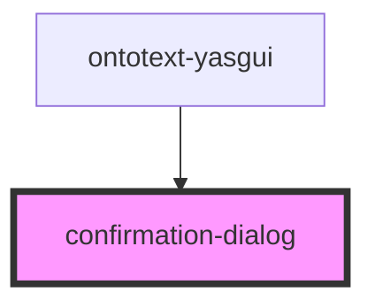

# confirmation-dialog

<!-- Auto Generated Below -->

## Properties

| Property         | Attribute | Description | Type                                  | Default                                                       |
| ---------------- | --------- | ----------- | ------------------------------------- | ------------------------------------------------------------- |
| `config`         | --        |             | `{ title: string; message: string; }` | `{     title: 'Confirmation',     message: 'Confirming?'   }` |
| `serviceFactory` | --        |             | `ServiceFactory`                      | `undefined`                                                   |

## Events

| Event                               | Description                                                                | Type               |
| ----------------------------------- | -------------------------------------------------------------------------- | ------------------ |
| `internalConfirmationApprovedEvent` | Event fired when confirmation is rejected and the dialog should be closed. | `CustomEvent<any>` |
| `internalConfirmationRejectedEvent` | Event fired when confirmation is rejected and the dialog should be closed. | `CustomEvent<any>` |

## Dependencies

### Used by

 - [ontotext-yasgui](../ontotext-yasgui-web-component)

### Graph

----------------------------------------------

*Built with [StencilJS](https://stenciljs.com/)*
