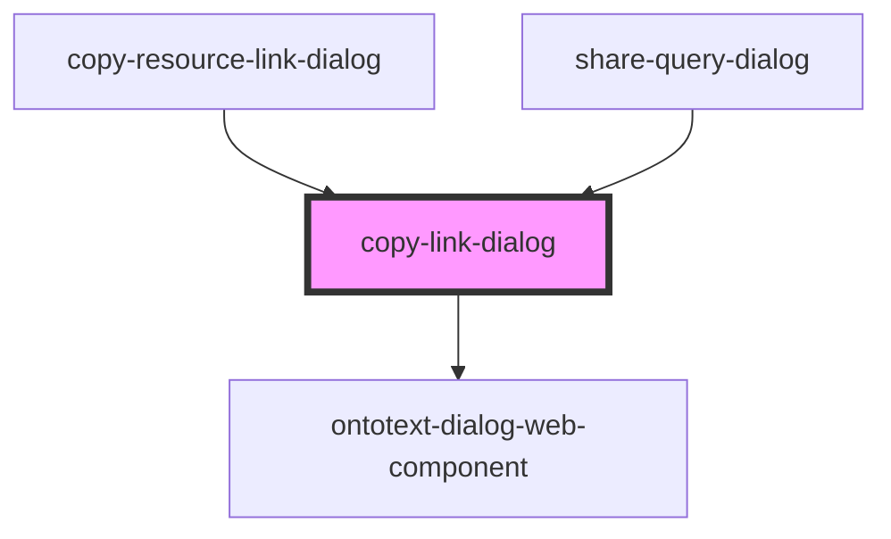

# copy-link-dialog

<!-- Auto Generated Below -->

## Properties

| Property                 | Attribute | Description | Type                                          | Default     |
| ------------------------ | --------- | ----------- | --------------------------------------------- | ----------- |
| `classes`                | `classes` |             | `string`                                      | `undefined` |
| `config`                 | --        |             | `{ dialogTitle?: string; copyLink: string; }` | `undefined` |
| `copyLinkEventsObserver` | --        |             | `CopyLInkObserver`                            | `undefined` |
| `serviceFactory`         | --        |             | `ServiceFactory`                              | `undefined` |

## Dependencies

### Used by

 - [copy-resource-link-dialog](../copy-resource-link-dialog)
 - [share-query-dialog](../share-query-dialog)

### Depends on

- [ontotext-dialog-web-component](../ontotext-dialog-web-component)

### Graph

----------------------------------------------

*Built with [StencilJS](https://stenciljs.com/)*
