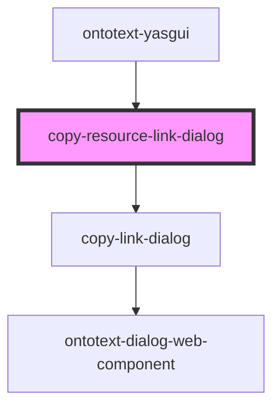

# copy-link-dialog

<!-- Auto Generated Below -->

## Properties

| Property         | Attribute       | Description | Type             | Default     |
| ---------------- | --------------- | ----------- | ---------------- | ----------- |
| `resourceLink`   | `resource-link` |             | `string`         | `undefined` |
| `serviceFactory` | --              |             | `ServiceFactory` | `undefined` |

## Events

| Event                                   | Description                                                                                                                                        | Type               |
| --------------------------------------- | -------------------------------------------------------------------------------------------------------------------------------------------------- | ------------------ |
| `internalResourceLinkCopiedEvent`       | Internal event fired when resource link is copied to the clipboard.                                                                                | `CustomEvent<any>` |
| `internalResourceLinkDialogClosedEvent` | Event fired when the dialog is closed by triggering one of the close controls, e.g. close or cancel button as well as clicking outside the dialog. | `CustomEvent<any>` |

## Dependencies

### Used by

 - [ontotext-yasgui](../ontotext-yasgui-web-component)

### Depends on

- [copy-link-dialog](../copy-link-dialog)

### Graph

----------------------------------------------

*Built with [StencilJS](https://stenciljs.com/)*
