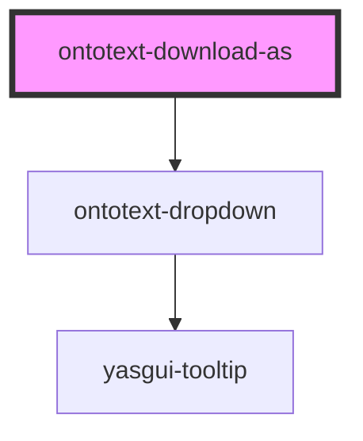

# ontotext-yasgui-download-as

<!-- Auto Generated Below -->

## Properties

| Property             | Attribute           | Description | Type                 | Default     |
| -------------------- | ------------------- | ----------- | -------------------- | ----------- |
| `infer`              | `infer`             |             | `boolean`            | `undefined` |
| `items`              | --                  |             | `DropdownOption[]`   | `undefined` |
| `nameLabelKey`       | `name-label-key`    |             | `string`             | `undefined` |
| `pluginName`         | `plugin-name`       |             | `string`             | `undefined` |
| `query`              | `query`             |             | `string`             | `undefined` |
| `sameAs`             | `same-as`           |             | `boolean`            | `undefined` |
| `tooltipLabelKey`    | `tooltip-label-key` |             | `string`             | `undefined` |
| `translationService` | --                  |             | `TranslationService` | `undefined` |

## Events

| Event                     | Description | Type                                   |
| ------------------------- | ----------- | -------------------------------------- |
| `internalDownloadAsEvent` |             | `CustomEvent<InternalDownloadAsEvent>` |

## Dependencies

### Depends on

- [ontotext-dropdown](../dropdown)

### Graph

----------------------------------------------

*Built with [StencilJS](https://stenciljs.com/)*
