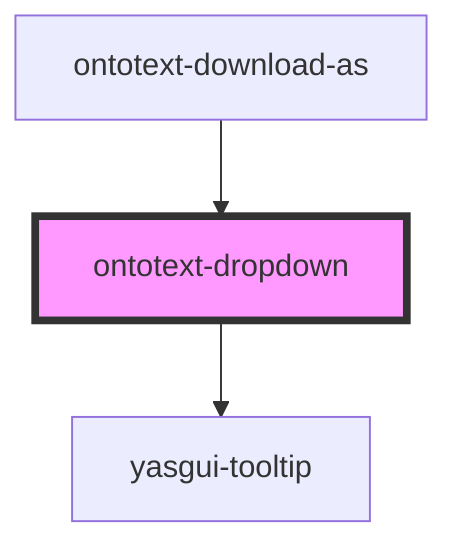

# ontotext-yasgui-dropdown

<!-- Auto Generated Below -->

## Properties

| Property             | Attribute           | Description | Type                 | Default     |
| -------------------- | ------------------- | ----------- | -------------------- | ----------- |
| `iconClass`          | `icon-class`        |             | `string`             | `''`        |
| `items`              | --                  |             | `DropdownOption[]`   | `undefined` |
| `nameLabelKey`       | `name-label-key`    |             | `string`             | `undefined` |
| `tooltipLabelKey`    | `tooltip-label-key` |             | `string`             | `undefined` |
| `translationService` | --                  |             | `TranslationService` | `undefined` |

## Events

| Event          | Description | Type                                              |
| -------------- | ----------- | ------------------------------------------------- |
| `valueChanged` |             | `CustomEvent<InternalDropdownValueSelectedEvent>` |

## Dependencies

### Used by

 - [ontotext-download-as](../download-as)

### Depends on

- [yasgui-tooltip](../ontotext-tooltip-web-component)

### Graph

----------------------------------------------

*Built with [StencilJS](https://stenciljs.com/)*
