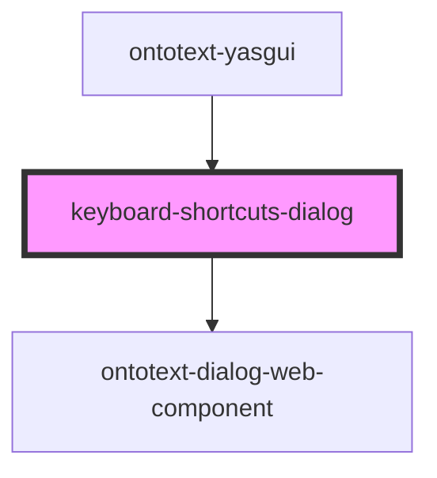

# keyboard-shortcuts-dialog

<!-- Auto Generated Below -->

## Properties

| Property             | Attribute | Description | Type                     | Default     |
| -------------------- | --------- | ----------- | ------------------------ | ----------- |
| `items`              | --        |             | `KeyboardShortcutItem[]` | `[]`        |
| `open`               | `open`    |             | `boolean`                | `undefined` |
| `translationService` | --        |             | `TranslationService`     | `undefined` |

## Events

| Event           | Description | Type                   |
| --------------- | ----------- | ---------------------- |
| `shortcutsOpen` |             | `CustomEvent<boolean>` |

## Dependencies

### Used by

 - [ontotext-yasgui](../ontotext-yasgui-web-component)

### Depends on

- [ontotext-dialog-web-component](../ontotext-dialog-web-component)

### Graph

----------------------------------------------

*Built with [StencilJS](https://stenciljs.com/)*
