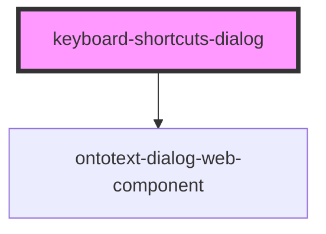

# keyboard-shortcuts-dialog

<!-- Auto Generated Below -->

## Properties

| Property             | Attribute | Description | Type                 | Default     |
| -------------------- | --------- | ----------- | -------------------- | ----------- |
| `items`              | --        |             | `string[]`           | `[]`        |
| `translationService` | --        |             | `TranslationService` | `undefined` |

## Dependencies

### Depends on

- [ontotext-dialog-web-component](../ontotext-dialog-web-component)

### Graph

----------------------------------------------

*Built with [StencilJS](https://stenciljs.com/)*
