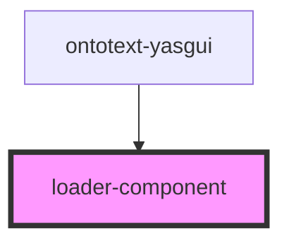

# loading-component

<!-- Auto Generated Below -->

## Properties

| Property            | Attribute            | Description | Type     | Default     |
| ------------------- | -------------------- | ----------- | -------- | ----------- |
| `additionalMessage` | `additional-message` |             | `string` | `undefined` |
| `message`           | `message`            |             | `string` | `undefined` |
| `size`              | `size`               |             | `string` | `undefined` |

## Dependencies

### Used by

 - [ontotext-yasgui](../ontotext-yasgui-web-component)

### Graph

----------------------------------------------

*Built with [StencilJS](https://stenciljs.com/)*
