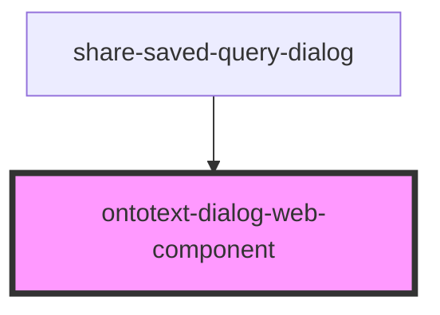

# ontotext-dialog-web-component

<!-- Auto Generated Below -->

## Properties

| Property | Attribute | Description | Type                                                           | Default     |
| -------- | --------- | ----------- | -------------------------------------------------------------- | ----------- |
| `config` | --        |             | `{ dialogTitle: string; onClose: (evt: MouseEvent) => void; }` | `undefined` |

## Dependencies

### Used by

 - [share-saved-query-dialog](../share-saved-query-dialog)

### Graph

----------------------------------------------

*Built with [StencilJS](https://stenciljs.com/)*
