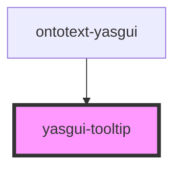

# yasgui-tooltip

<!-- Auto Generated Below -->

## Properties

| Property      | Attribute       | Description | Type      | Default     |
| ------------- | --------------- | ----------- | --------- | ----------- |
| `dataTooltip` | `data-tooltip`  |             | `string`  | `undefined` |
| `placement`   | `placement`     |             | `string`  | `undefined` |
| `showOnClick` | `show-on-click` |             | `boolean` | `undefined` |

## Dependencies

### Used by

 - [ontotext-yasgui](../ontotext-yasgui-web-component)

### Graph

----------------------------------------------

*Built with [StencilJS](https://stenciljs.com/)*
