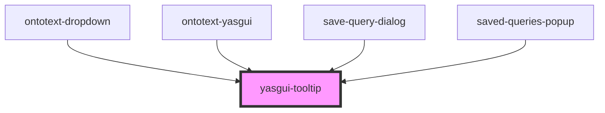

# yasgui-tooltip

<!-- Auto Generated Below -->

## Properties

| Property            | Attribute             | Description | Type      | Default     |
| ------------------- | --------------------- | ----------- | --------- | ----------- |
| `placement`         | `placement`           |             | `string`  | `undefined` |
| `showOnClick`       | `show-on-click`       |             | `boolean` | `undefined` |
| `yasguiDataTooltip` | `yasgui-data-tooltip` |             | `string`  | `undefined` |

## Dependencies

### Used by

 - [ontotext-dropdown](../dropdown)
 - [ontotext-yasgui](../ontotext-yasgui-web-component)
 - [save-query-dialog](../save-query-dialog)
 - [saved-queries-popup](../saved-queries-popup)

### Graph

```mermaid
graph TD;
  ontotext-dropdown --> yasgui-tooltip
  ontotext-yasgui --> yasgui-tooltip
  save-query-dialog --> yasgui-tooltip
  saved-queries-popup --> yasgui-tooltip
  style yasgui-tooltip fill:#f9f,stroke:#333,stroke-width:4px
```

----------------------------------------------

*Built with [StencilJS](https://stenciljs.com/)*
