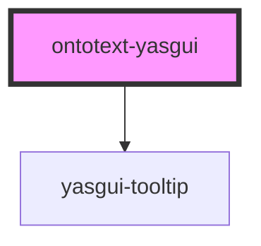

# ontotext-yasgui

<!-- Auto Generated Below -->

## Properties

| Property | Attribute | Description                                                   | Type                  | Default     |
| -------- | --------- | ------------------------------------------------------------- | --------------------- | ----------- |
| `config` | --        | An input object property containing the yasgui configuration. | `YasguiConfiguration` | `undefined` |

## Events

| Event           | Description                                          | Type                                 |
| --------------- | ---------------------------------------------------- | ------------------------------------ |
| `queryExecuted` | Event emitted when before query to be executed.      | `CustomEvent<{ query: string; }>`    |
| `queryResponse` | Event emitted when after query response is returned. | `CustomEvent<{ duration: number; }>` |

## Methods

### `setQuery(query: string) => Promise<void>`

#### Returns

Type: `Promise<void>`

## Dependencies

### Depends on

- [yasgui-tooltip](../tooltip)

### Graph

----------------------------------------------

*Built with [StencilJS](https://stenciljs.com/)*
