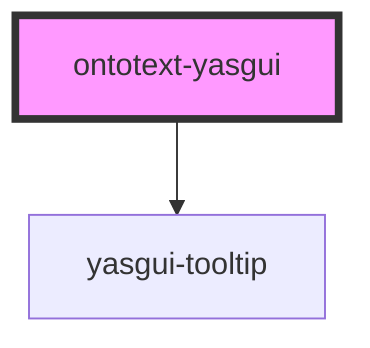

# ontotext-yasgui

<!-- Auto Generated Below -->

## Overview

This is the custom web component which is adapter for the yasgui library. It allows as to
configure and extend the library without potentially breaking the component clients.

The component have some sane defaults for most of its configurations. So, in practice, it can be
used as is by providing just the sparql endpoint config.
For other customizations, the default configurations can be overridden by providing a
configuration object to the component.

There is a configuration watcher which triggers the initialization again after a change is
detected.

During the component initialization, the provided configuration is passed down to a bunch of
configuration helpers which use it to override and extend the defaults.

After the configuration is ready, then a yasgui instance is created with it.

After the yasgui instance is ready, then a post initialization phase begins. During the phase the
yasgui can be tweaked using the values from the configuration.

## Properties

| Property | Attribute | Description                                                   | Type                  | Default     |
| -------- | --------- | ------------------------------------------------------------- | --------------------- | ----------- |
| `config` | --        | An input object property containing the yasgui configuration. | `YasguiConfiguration` | `undefined` |

## Events

| Event           | Description                                          | Type                                 |
| --------------- | ---------------------------------------------------- | ------------------------------------ |
| `queryExecuted` | Event emitted when before query to be executed.      | `CustomEvent<{ query: string; }>`    |
| `queryResponse` | Event emitted when after query response is returned. | `CustomEvent<{ duration: number; }>` |

## Methods

### `setQuery(query: string) => Promise<void>`

#### Returns

Type: `Promise<void>`

## Dependencies

### Depends on

- [yasgui-tooltip](../ontotext-tooltip-web-component)

### Graph

----------------------------------------------

*Built with [StencilJS](https://stenciljs.com/)*
