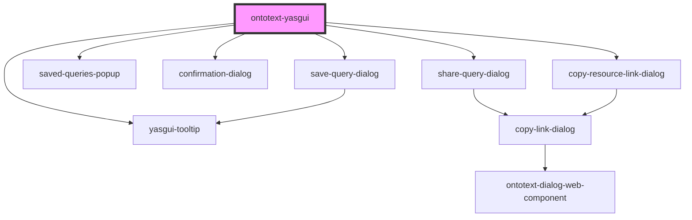

# ontotext-yasgui

<!-- Auto Generated Below -->

## Overview

This is the custom web component which is adapter for the yasgui library. It allows as to
configure and extend the library without potentially breaking the component clients.

The component have some sane defaults for most of its configurations. So, in practice, it can be
used as is by providing just the sparql endpoint config.
For other customizations, the default configurations can be overridden by providing an external
configuration object compliant with the <code>ExternalYasguiConfiguration</code> interface to the
component.

There is a configuration watcher which triggers the initialization again after a change is
detected.

During the component initialization, the provided external configuration is passed down to a
configuration builder which use it to override and extend the yasgui library defaults.

After the configuration is ready, then a yasgui instance is created with it.

After the yasgui instance is ready, then a post initialization phase begins. During the phase the
yasgui can be tweaked using the values from the configuration.

## Properties

| Property           | Attribute  | Description                                                       | Type                          | Default     |
| ------------------ | ---------- | ----------------------------------------------------------------- | ----------------------------- | ----------- |
| `config`           | --         | An input object property containing the yasgui configuration.     | `ExternalYasguiConfiguration` | `undefined` |
| `language`         | `language` | An input property containing the chosen translation language.     | `string`                      | `undefined` |
| `savedQueryConfig` | --         | A configuration model related with all the saved queries actions. | `SavedQueryConfig`            | `undefined` |

## Events

| Event                  | Description                                                                                                                                             | Type                         |
| ---------------------- | ------------------------------------------------------------------------------------------------------------------------------------------------------- | ---------------------------- |
| `createSavedQuery`     | Event emitted when saved query payload is collected and the query should be saved by the component client.                                              | `CustomEvent<SaveQueryData>` |
| `deleteSavedQuery`     | Event emitted when a saved query should be deleted. In result the client must perform a query delete.                                                   | `CustomEvent<SaveQueryData>` |
| `loadSavedQueries`     | Event emitted when saved queries is expected to be loaded by the component client and provided back in order to be displayed.                           | `CustomEvent<boolean>`       |
| `output`               | Event emitter used to send message to the clients of component.                                                                                         | `CustomEvent<OutputEvent>`   |
| `queryShareLinkCopied` | Event emitted when query share link gets copied in the clipboard.                                                                                       | `CustomEvent<any>`           |
| `shareQuery`           | Event emitted when saved query share link has to be build by the client.                                                                                | `CustomEvent<TabQueryModel>` |
| `shareSavedQuery`      | Event emitted when saved query share link has to be build by the client.                                                                                | `CustomEvent<SaveQueryData>` |
| `updateSavedQuery`     | Event emitted when a query payload is updated and the query name is the same as the one being edited. In result the client must perform a query update. | `CustomEvent<SaveQueryData>` |

## Methods

### `abortQuery() => Promise<any>`

Aborts the running query if any.

#### Returns

Type: `Promise<any>`

### `changeRenderMode(newRenderMode: any) => Promise<void>`

Changes rendering mode of component.

#### Returns

Type: `Promise<void>`

### `getEmbeddedResultAsCSV() => Promise<unknown>`

Fetches the query result and return it as CSV.

#### Returns

Type: `Promise<unknown>`

### `getEmbeddedResultAsJson() => Promise<unknown>`

Fetches the query result and return it as JSON.

#### Returns

Type: `Promise<unknown>`

### `getQuery() => Promise<string>`

Fetches the query from YASQE editor.

#### Returns

Type: `Promise<string>`

### `getQueryMode() => Promise<string>`

Utility method allowing the client to get the mode of the query which is written in the current
editor tab.
The query mode can be either `query` or `update` regarding the query mode. This method just
exposes the similar utility method from the yasqe component.

#### Returns

Type: `Promise<string>`

A promise which resolves with a string representing the query mode.

### `getQueryType() => Promise<string>`

Utility method allowing the client to get the type of the query which is written in the current
editor tab.
The query mode can be `INSERT`, `LOAD`, `CLEAR`, `DELETE`, etc. This method just exposes the
similar utility method from the yasqe component.

#### Returns

Type: `Promise<string>`

A promise which resolves with a string representing the query type.

### `hideYasqeActionButton(yasqeActionButtonNames: YasqeButtonType | YasqeButtonType[]) => Promise<void>`

Hides the YASQE action button with the name <code>yasqeActionButtonNames</code>.

#### Returns

Type: `Promise<void>`

### `isQueryDirty() => Promise<boolean>`

Checks whether the query has been modified after the initialization of the YASQE editor.

#### Returns

Type: `Promise<boolean>`

### `isQueryValid() => Promise<boolean>`

Checks if query is valid.

#### Returns

Type: `Promise<boolean>`

### `openTab(queryModel: TabQueryModel) => Promise<void>`

Allows the client to init the editor using a query model. When the query and query name are
found in any existing opened tab, then it'd be focused. Otherwise a new tab will be created and
initialized using the provided query model.

#### Returns

Type: `Promise<void>`

### `query(renderingMode?: RenderingMode) => Promise<any>`

Executes the YASQE query from the currently opened tab and switches to the specified <code>renderingMode</code> when the query is executed.

#### Returns

Type: `Promise<any>`

### `resetResults(refreshYasr: boolean) => Promise<any>`

Clears the results of the query.

#### Returns

Type: `Promise<any>`

### `setQuery(query: string) => Promise<void>`

Allows the client to set a query in the current opened tab.
The cursor position is preserved.

#### Returns

Type: `Promise<void>`

### `showYasqeActionButton(yasqeActionButtonNames: YasqeButtonType | YasqeButtonType[]) => Promise<void>`

Shows the YASQE action button with the name <code>yasqeActionButtonNames</code>.

#### Returns

Type: `Promise<void>`

## Dependencies

### Depends on

- [yasgui-tooltip](../ontotext-tooltip-web-component)
- [save-query-dialog](../save-query-dialog)
- [saved-queries-popup](../saved-queries-popup)
- [confirmation-dialog](../confirmation-dialog)
- [share-query-dialog](../share-query-dialog)
- [copy-resource-link-dialog](../copy-resource-link-dialog)

### Graph

----------------------------------------------

*Built with [StencilJS](https://stenciljs.com/)*
