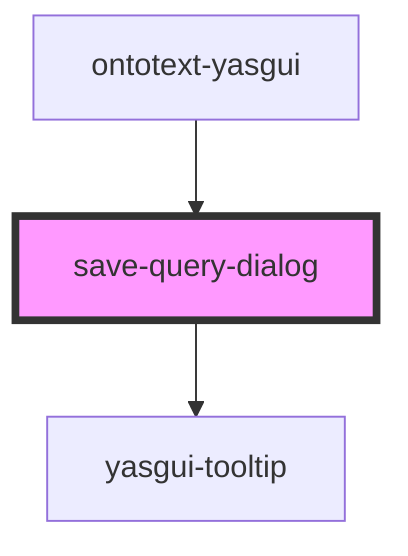

# save-query-dialog

<!-- Auto Generated Below -->

## Properties

| Property         | Attribute | Description                                                                                | Type             | Default     |
| ---------------- | --------- | ------------------------------------------------------------------------------------------ | ---------------- | ----------- |
| `data`           | --        | Input holding the saved query data if available. This data is used to initialize the form. | `SaveQueryData`  | `undefined` |
| `serviceFactory` | --        |                                                                                            | `ServiceFactory` | `undefined` |

## Events

| Event                                | Description                                                                                                      | Type                         |
| ------------------------------------ | ---------------------------------------------------------------------------------------------------------------- | ---------------------------- |
| `internalSaveQueryDialogClosedEvent` | Event fired when the dialog is closed by triggering one of the close controls, e.g. close or cancel button.      | `CustomEvent<any>`           |
| `internalSaveQueryEvent`             | Event fired when the create button in the dialog is triggered. The event payload holds the new saved query data. | `CustomEvent<SaveQueryData>` |

## Dependencies

### Used by

 - [ontotext-yasgui](../ontotext-yasgui-web-component)

### Depends on

- [yasgui-tooltip](../ontotext-tooltip-web-component)

### Graph

----------------------------------------------

*Built with [StencilJS](https://stenciljs.com/)*
