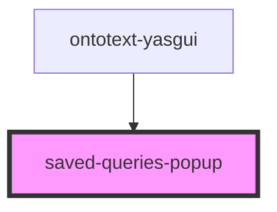

# saved-queries-popup

<!-- Auto Generated Below -->

## Properties

| Property | Attribute | Description | Type               | Default     |
| -------- | --------- | ----------- | ------------------ | ----------- |
| `data`   | --        |             | `SavedQueriesData` | `undefined` |

## Events

| Event                                 | Description                                                | Type                         |
| ------------------------------------- | ---------------------------------------------------------- | ---------------------------- |
| `internalCloseSavedQueriesPopupEvent` | Event fired when the saved queries popup should be closed. | `CustomEvent<any>`           |
| `internalEditSavedQueryEvent`         | Event fired when the edit saved query button is triggered. | `CustomEvent<SaveQueryData>` |
| `internalSaveQuerySelectedEvent`      | Event fired when a saved query is selected from the list.  | `CustomEvent<SaveQueryData>` |

## Dependencies

### Used by

 - [ontotext-yasgui](../ontotext-yasgui-web-component)

### Graph

----------------------------------------------

*Built with [StencilJS](https://stenciljs.com/)*
