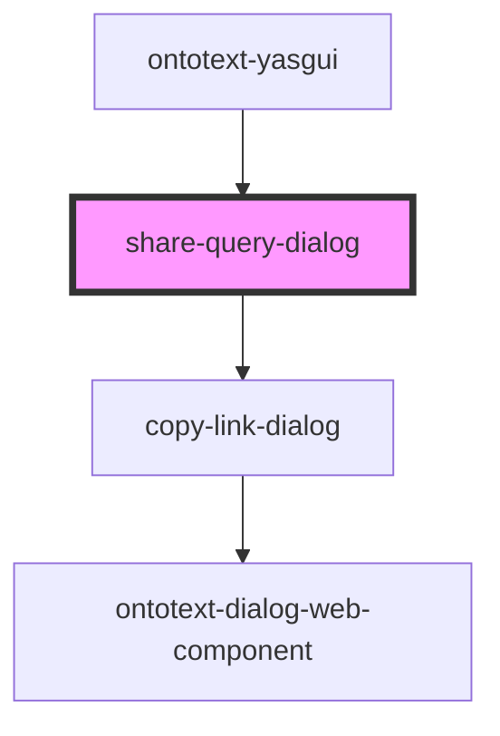

# share-saved-query-dialog

<!-- Auto Generated Below -->

## Properties

| Property         | Attribute | Description | Type                          | Default     |
| ---------------- | --------- | ----------- | ----------------------------- | ----------- |
| `config`         | --        |             | `{ shareQueryLink: string; }` | `undefined` |
| `serviceFactory` | --        |             | `ServiceFactory`              | `undefined` |

## Events

| Event                                 | Description                                                                                                                                           | Type               |
| ------------------------------------- | ----------------------------------------------------------------------------------------------------------------------------------------------------- | ------------------ |
| `internalQueryShareLinkCopiedEvent`   | Internal event fired when saved query share link is copied in the clipboard.                                                                          | `CustomEvent<any>` |
| `internalShareQueryDialogClosedEvent` | Event fired when the dialog is closed by triggering one of the close controls, e.g. close or cancel button as well as clicking outside of the dialog. | `CustomEvent<any>` |

## Dependencies

### Used by

 - [ontotext-yasgui](../ontotext-yasgui-web-component)

### Depends on

- [copy-link-dialog](../copy-link-dialog)

### Graph

----------------------------------------------

*Built with [StencilJS](https://stenciljs.com/)*
