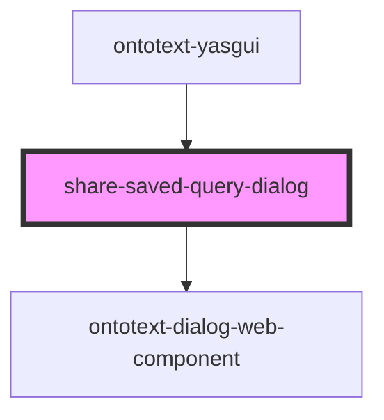

# share-saved-query-dialog

<!-- Auto Generated Below -->

## Properties

| Property         | Attribute | Description | Type                                               | Default     |
| ---------------- | --------- | ----------- | -------------------------------------------------- | ----------- |
| `config`         | --        |             | `{ dialogTitle: string; shareQueryLink: string; }` | `undefined` |
| `serviceFactory` | --        |             | `ServiceFactory`                                   | `undefined` |

## Events

| Event                                      | Description                                                                                                                                           | Type               |
| ------------------------------------------ | ----------------------------------------------------------------------------------------------------------------------------------------------------- | ------------------ |
| `internalSavedQueryShareLinkCopiedEvent`   |                                                                                                                                                       | `CustomEvent<any>` |
| `internalShareSavedQueryDialogClosedEvent` | Event fired when the dialog is closed by triggering one of the close controls, e.g. close or cancel button as well as clicking outside of the dialog. | `CustomEvent<any>` |

## Dependencies

### Used by

 - [ontotext-yasgui](../ontotext-yasgui-web-component)

### Depends on

- [ontotext-dialog-web-component](../ontotext-dialog-web-component)

### Graph

----------------------------------------------

*Built with [StencilJS](https://stenciljs.com/)*
